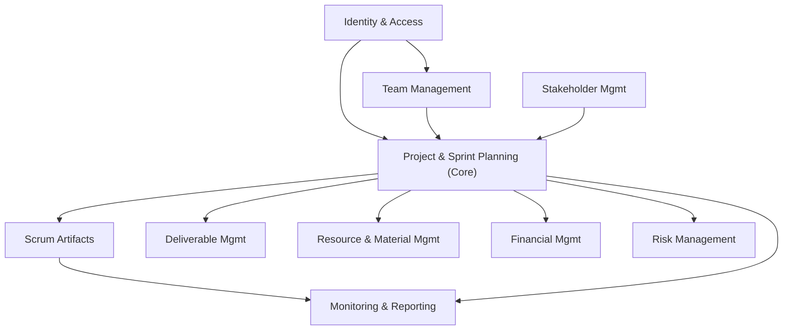

# ScrumFlow — Application de Gestion de Projets Informatiques (Scrum)

## 📌 Présentation

**ScrumFlow** est une application de gestion de projets informatiques basée sur la méthodologie **Scrum**, conçue selon une architecture **microservices** (Java / Spring Boot) et une démarche **Domain-Driven Design (DDD)**.

L'application permet aux organisations de piloter l'ensemble du cycle de vie d'un projet Scrum : constitution des équipes, planification des sprints, gestion du backlog, suivi des livrables, allocation des ressources, gestion budgétaire et gestion des risques.

Chaque domaine métier identifié via le DDD correspond à un **Bounded Context**, lui-même candidat naturel à devenir un **microservice indépendant**, avec sa propre base de données et son propre langage ubiquitaire.

---

## 🎯 Objectifs du projet

- Mettre en pratique le **Domain-Driven Design** (Bounded Context, Agrégats, Langage Ubiquitaire, Context Map).
- Concevoir une architecture **microservices** avec Spring Boot.
- Modéliser fidèlement le fonctionnement d'un projet Scrum réel.

---

## 🧩 Domaines métier (Bounded Contexts)

| Domaine | Rôle | Agrégat racine |
|---|---|---|
| **Identity & Access Management** | Gestion des utilisateurs, rôles et authentification | `Utilisateur` |
| **Stakeholder Management** | Gestion des parties prenantes (clients, sponsors) | `PartiePrenante` |
| **Team Management** | Constitution et gestion des équipes Scrum | `Equipe` |
| **Project & Sprint Planning** *(Core Domain)* | Gestion des projets, sprints, epics, user stories | `Projet` |
| **Scrum Artifacts** | Product Backlog, Sprint Backlog, Increment | `ProductBacklog` |
| **Deliverable Management** | Suivi des livrables et jalons | `Livrable` |
| **Resource & Material Management** | Gestion des ressources humaines et matérielles | `Ressource` |
| **Financial Management** | Gestion du budget et des dépenses | `Budget` |
| **Risk Management** | Identification et suivi des risques projet | `Risque` |
| **Monitoring & Reporting** | Vélocité, burndown chart, indicateurs projet | `RapportSprint` |

> Le **Core Domain** de l'application est *Project & Sprint Planning* : c'est le cœur du fonctionnement Scrum. Les autres domaines sont des contextes de support (Supporting/Generic Domains).

---

## 📖 Détail des domaines

### 1. Identity & Access Management
**Langage ubiquitaire** : Utilisateur, Compte, Rôle, Permission, Authentification.
**Fonctionnalités** : inscription, connexion/déconnexion, gestion des rôles (Admin, Scrum Master, Product Owner, Développeur), gestion du profil.

### 2. Stakeholder Management
**Langage ubiquitaire** : Partie Prenante, Client, Sponsor, Intérêt, Influence.
**Fonctionnalités** : enregistrement et classification des parties prenantes, suivi de leurs attentes.

### 3. Team Management
**Langage ubiquitaire** : Équipe, Membre, Scrum Master, Product Owner, Capacité.
**Fonctionnalités** : création d'équipes, affectation des rôles Scrum, gestion des disponibilités.

### 4. Project & Sprint Planning
**Langage ubiquitaire** : Projet, Sprint, Epic, User Story, Story Point, Sprint Goal.
**Fonctionnalités** : création de projets, découpage en user stories, planification et clôture de sprints, estimation.

### 5. Scrum Artifacts
**Langage ubiquitaire** : Product Backlog, Sprint Backlog, Increment, Raffinement.
**Fonctionnalités** : gestion du backlog produit et du backlog de sprint, suivi de l'increment livré.

### 6. Deliverable Management
**Langage ubiquitaire** : Livrable, Version, Release, Jalon, Validation.
**Fonctionnalités** : création, soumission et validation des livrables, publication de releases.

### 7. Resource & Material Management
**Langage ubiquitaire** : Ressource, Matériel, Allocation, Réservation.
**Fonctionnalités** : inventaire du matériel, allocation aux projets, gestion des disponibilités.

### 8. Financial Management
**Langage ubiquitaire** : Budget, Coût, Dépense, Facture, Écart budgétaire.
**Fonctionnalités** : définition du budget, suivi des dépenses, facturation.

### 9. Risk Management
**Langage ubiquitaire** : Risque, Probabilité, Impact, Plan de Mitigation.
**Fonctionnalités** : identification, évaluation et suivi des risques.

### 10. Monitoring & Reporting
**Langage ubiquitaire** : Vélocité, Burndown Chart, KPI, Rapport d'avancement.
**Fonctionnalités** : calcul de vélocité, génération de burndown/burnup charts, tableaux de bord.

---

## 🏗️ Architecture technique

- **Langage** : Java
- **Framework** : Spring Boot
- **Style d'architecture** : Microservices (1 service par Bounded Context)
- **Communication inter-services** :
  - Synchrone (REST) pour les requêtes directes
  - Asynchrone (événements de domaine, ex. `SprintClos`, `LivrableValidé`) pour le découplage entre contextes
- **Approche de conception** : Domain-Driven Design (Agrégats, Entités, Value Objects, Repositories, Bounded Contexts, Context Map)

---

## 🗺️ Context Map (relations entre domaines)

---

## 📚 Contexte académique

Projet réalisé dans le cadre de la matière **Développement Avancé** (Microservices — Java / Spring Boot), avec application des principes du **Domain-Driven Design**.
