# ScrumFlow — Diagrammes de Cas d'Utilisation
## Contexte : 📅 Project & Sprint Planning *(Core Domain)*

> Ce document présente l'ensemble des diagrammes UML de cas d'utilisation du **Core Domain** `Project & Sprint Planning` de l'application ScrumFlow, modélisés avec la syntaxe **Mermaid**.

---

## 🎭 Acteurs impliqués dans ce contexte

| Acteur | Rôle |
|---|---|
| **Product Owner (PO)** | Priorise le backlog, crée les epics/stories, pilote le projet |
| **Scrum Master (SM)** | Facilite les cérémonies Scrum, planifie et clôture les sprints |
| **Développeur** | Estime les stories, consulte le tableau Kanban |
| **Administrateur** | Peut créer des projets aux côtés du PO |
| **Système** | Acteur secondaire automatique (calculs, événements de domaine) |

---

## 📌 UC-4.1 — Créer un Projet

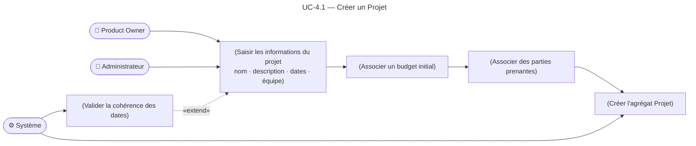

> **Préconditions** : L'acteur est authentifié avec le rôle PO ou Admin.  
> **Post-conditions** : L'agrégat `Projet` est crée à l'état *"Initialisé"*.

---

## 📌 UC-4.2 — Créer un Epic

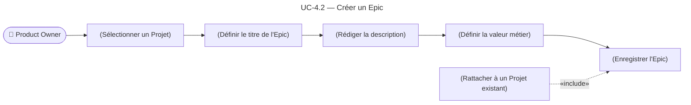

> **Préconditions** : Un `Projet` existe et est à l'état actif.  
> **Post-conditions** : L'`Epic` est créé et rattaché au projet.

---

## 📌 UC-4.3 — Créer une User Story

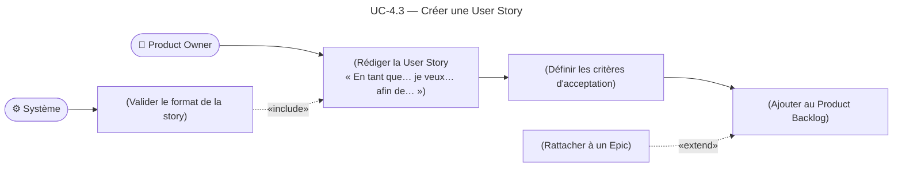

> **Préconditions** : Un `Projet` existe ; un `Epic` peut exister (optionnel).  
> **Post-conditions** : La `User Story` est créée dans le Product Backlog à l'état *"Non estimée"*.

---

## 📌 UC-4.4 — Estimer une User Story (Story Points)

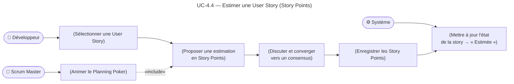

> **Acteur principal** : Équipe de développement.  
> **Acteur secondaire** : Scrum Master (facilitateur).  
> **Post-conditions** : La story possède une valeur en Story Points, elle change d'état vers *"Estimée"*.

---

## 📌 UC-4.5 — Planifier un Sprint (Sprint Planning)

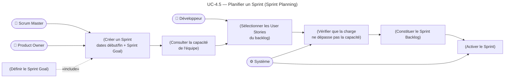

> **Préconditions** : Le Product Backlog est priorisé et les stories sont estimées.  
> **Post-conditions** : Le `Sprint` passe à l'état *"Actif"* ; le Sprint Backlog est constitué.

---

## 📌 UC-4.6 — Définir le Sprint Goal

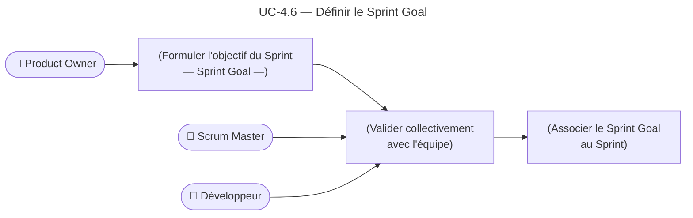

> **Post-conditions** : Le `Sprint Goal` est enregistré et visible par tous les membres de l'équipe.

---

## 📌 UC-4.7 — Clôturer un Sprint (Sprint Review + Retrospective)

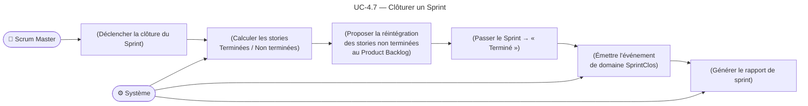

> **Post-conditions** : Le sprint est *"Terminé"* ; l'événement `SprintClos` est émis vers **Monitoring & Reporting** et **Scrum Artifacts**.

---

## 📌 UC-4.8 — Modifier le périmètre d'un Sprint en cours

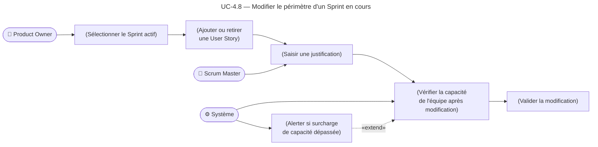

> **Extensions** : Alerte si la modification entraîne un dépassement de capacité.

---

## 📌 UC-4.9 — Consulter le tableau Kanban du Sprint

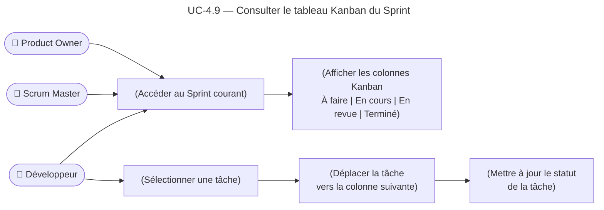

> **Post-conditions** : Le statut de la tâche est mis à jour en temps réel dans le Sprint Backlog.

---

## 🗺️ Diagramme de synthèse — Vue globale du Core Domain

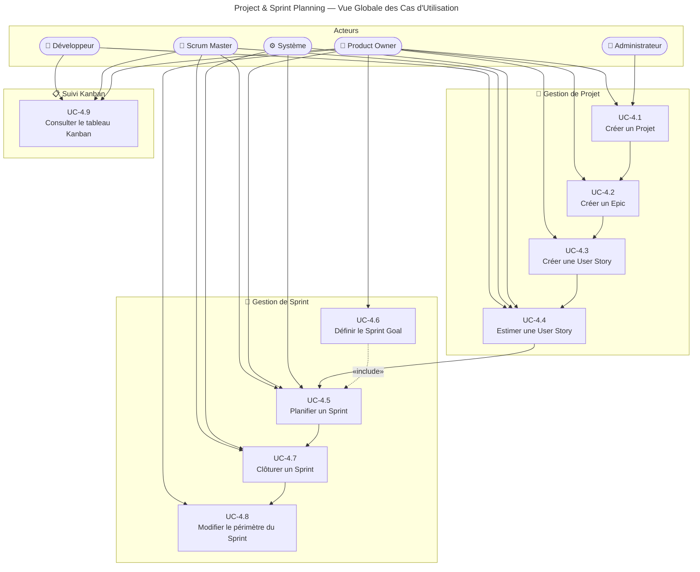

---

## 🔗 Interactions avec les autres Bounded Contexts

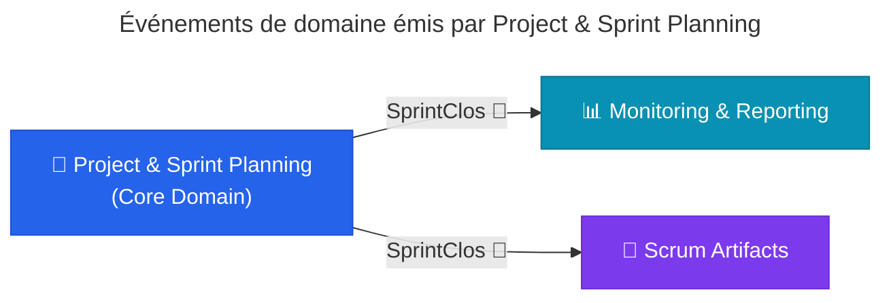

---

## 📚 Légende des relations UML

| Notation | Signification |
|---|---|
| `-->` | Association (acteur déclenche le cas d'utilisation) |
| `-.->` avec `«include»` | Le UC inclut obligatoirement l'autre UC |
| `-.->` avec `«extend»` | Le UC étend un autre UC dans un cas particulier |
| Sous-graphe | Regroupement thématique (package UML) |

---

> *Document généré pour le projet **ScrumFlow** — Matière : Développement Avancé (Microservices Java / Spring Boot — DDD)*
